# Process Flow for Using This Tool

```mermaid
graph TD
    A[👤 Entry Point] --> B{Input Type}
    B -->|RFP| C[👤 RFP Document]
    B -->|Pre-sales Discovery| D[👤 Client Discussions/Transcripts]
    B -->|Assessment Output| E[👤 Assessment Results]
    
    C --> F[🤖 AI Extracts Features]
    D --> F
    E --> F
    
    F --> G[🤖 NLP Identifies & Categorizes Features]
    G --> H[🤖 Map Features to Catalog Items]
    
    H --> I[📊 Present Features to User]
    I --> J[👤 User Reviews & Modifies Selections]
    
    J --> K[🤖 For Each Feature: Determine T-shirt Size]
    K --> L[XS, S, M, L, XL]
    L --> M[👤 User Adjusts Sizes]
    
    M --> N[🤖 AI Calculates Total Estimate]
    N --> O[🤖 Use calculate_estimate Function]
    
    O --> P[📊 Present Estimate Breakdown]
    P --> Q[📊 Show Total Hours per Role]
    P --> R[📊 Show Detailed Breakdown per Feature]
```

**Legend:**
- 🤖 = AI-driven step
- 👤 = Human-driven step
- 📊 = Presentation/Output

## Process Steps

1. Entry points to the process
  a. Replying to a RFP (feed RFP to AI to extract features)
  b. Pre-sales discovery (gather requirements from client discussions, including transcripts of calls)
  c. Output of assessment process
2. Extract features from the input using AI
  a. Use NLP techniques to identify and categorize features
  b. Map identified features to catalog items
3. Present extracted features to user for review
  a. Allow user to modify selections
4. For each selected feature, determine T-shirt size (XS, S, M, L, XL)
    a. Provide definitions and examples for each size
    b. Allow user to adjust sizes based on their understanding
5. Ask AI to calculate total estimate based on selected features and sizes
  a. AI will use `calculate_estimate` function
6. Present estimate breakdown to user
  a. Show total hours per role
  b. Provide detailed breakdown per feature

